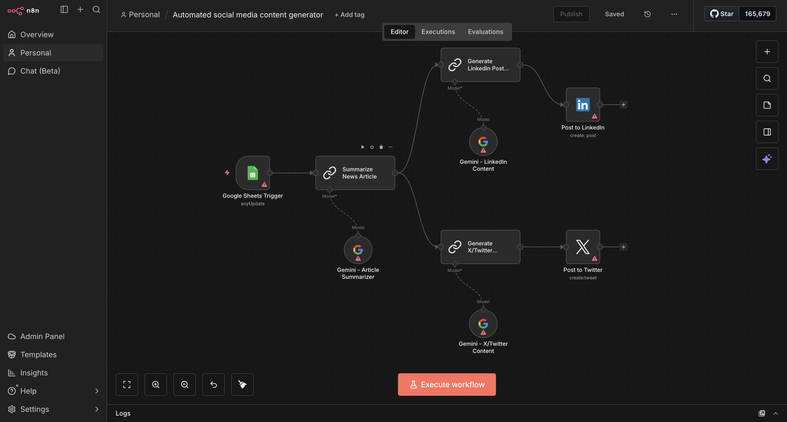

# Automated-Social-Media-Content-Generation



An AI-powered tool that automatically generates engaging social media content for various platforms.  This project leverages natural language processing and machine learning to create relevant, creative, and platform-optimized posts.

## 🚀 Features

- **Multi-Platform Support**: Generate content optimized for Twitter, Instagram, LinkedIn, Facebook, and more
- **AI-Powered Generation**: Uses advanced language models to create engaging and relevant content
- **Customizable Tone**:  Adjust the tone and style (professional, casual, humorous, etc.)
- **Hashtag Suggestions**:  Automatically generates relevant hashtags for better reach
- **Content Scheduling**: Plan and schedule posts in advance
- **Analytics Integration**: Track engagement and performance metrics

## 📋 Requirements

```
python >= 3.8
```

## 🔧 Installation

1. Clone the repository:
```bash
git clone https://github.com/PreetKot/Automated-Social-Media-Content-Generation. git
cd Automated-Social-Media-Content-Generation
```

2. Install dependencies:
```bash
pip install -r requirements.txt
```

3. Set up environment variables:
```bash
cp .env.example .env
# Edit .env with your API keys
```

## 💻 Usage

### Basic Usage

```python
from content_generator import SocialMediaGenerator

# Initialize the generator
generator = SocialMediaGenerator()

# Generate a post
post = generator.generate(
    topic="artificial intelligence",
    platform="twitter",
    tone="professional"
)

print(post)
```

### Command Line Interface

```bash
python main.py --topic "your topic" --platform twitter --tone casual
```

## 🎯 Supported Platforms

- **Twitter/X**: Character-optimized tweets with hashtags
- **Instagram**: Caption generation with emoji support
- **LinkedIn**: Professional posts and articles
- **Facebook**: Engaging status updates
- **TikTok**: Creative captions and hooks

## 🛠️ Configuration

Edit `config.yaml` to customize:
- Default tone and style
- Content length preferences
- Hashtag count
- Platform-specific settings
- API configurations

## 📊 Examples

### Generate Twitter Thread
```python
thread = generator.generate_thread(
    topic="machine learning basics",
    num_tweets=5
)
```

### Generate Instagram Caption
```python
caption = generator.generate(
    topic="sunset photography",
    platform="instagram",
    include_emojis=True
)
```

## 🤝 Contributing

Contributions are welcome! Please feel free to submit a Pull Request. 

1. Fork the project
2. Create your feature branch (`git checkout -b feature/AmazingFeature`)
3. Commit your changes (`git commit -m 'Add some AmazingFeature'`)
4. Push to the branch (`git push origin feature/AmazingFeature`)
5. Open a Pull Request


## 👤 Author

**PreetKot**
- GitHub:  [@PreetKot](https://github.com/PreetKot)

## 🙏 Acknowledgments

- OpenAI for GPT models
- Contributors and supporters of this project
- The open-source community


⭐ Star this repository if you find it helpful!
